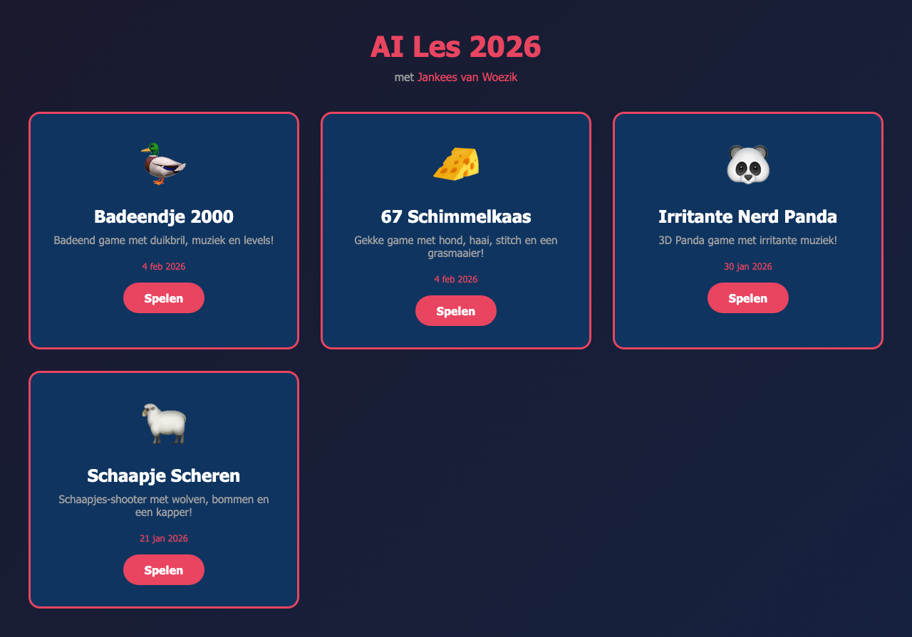

# AI Les 2026

Op basisschool De Peelparel heb ik AI lessen gegeven aan kinderen uit groep 5 t/m 8. De kinderen hebben hun eigen games gemaakt door te "vibe coden" - ze vertelden in gewone taal wat ze wilden en [Claude](https://claude.ai) hielp het te bouwen.

Kinderen van 11 jaar maakten in 30 minuten een 3D game, from scratch! Vroeger was dit alleen weggelegd voor ervaren programmeurs. De kinderen hadden geen uitleg nodig en wilden eigenlijk niet meer stoppen.

## De games

Bekijk alle games op: https://jankeesvw.github.io/ai-les-peelparel/

## Techniek

De games zijn gemaakt met [Claude Code](https://claude.ai/claude-code) en het AI model Claude Opus 4.5.

## Meer info

Lees meer over deze les in mijn [LinkedIn post](https://www.linkedin.com/feed/update/urn:li:activity:7422218629427007489/).

## Contact

[Jankees van Woezik](https://jankeesvw.com)
